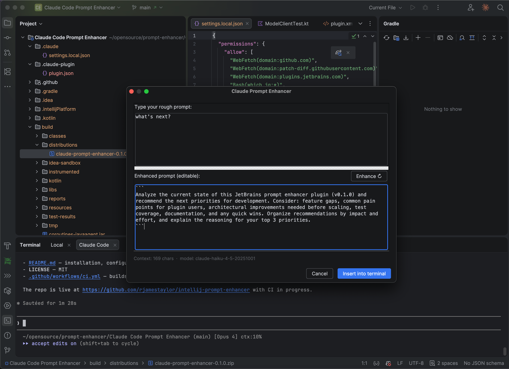

# IntelliJ Prompt Enhancer

A JetBrains IDE plugin that rewrites rough prompts into clear, well-structured instructions before you submit them to [Claude Code](https://docs.anthropic.com/en/docs/claude-code).

Type a quick thought, press a shortcut, review the enhanced version, and insert it back into the terminal — all without leaving your IDE.



## How it works

1. Type a rough prompt in the Claude Code terminal panel
2. Press **Shift+Opt+Cmd+.** (Mac) or **Shift+Ctrl+Alt+.** (Windows/Linux)
3. Review the enhanced prompt in a two-pane dialog, edit if needed
4. Click **Insert into terminal** — then hit Enter to submit

The plugin never auto-submits. You always review before sending.

## Features

- **Three API backends** — Anthropic Messages API, any OpenAI-compatible endpoint (Ollama, LM Studio, etc.), or the Claude CLI
- **Ambient project context** — optionally includes your CLAUDE.md, open files/selection, and recent git history to add specificity
- **Customizable system prompt** — control exactly how prompts are rewritten
- **Multi-version terminal support** — works with the Reworked Terminal (2025.3+), Block Terminal, Classic Terminal, and falls back to clipboard injection
- **Secure** — API keys stored in the OS keychain via JetBrains PasswordSafe

## Requirements

- **[Claude Code \[Beta\] plugin](https://plugins.jetbrains.com/plugin/27310-claude-code-beta-)** — this plugin depends on it and will not load without it
- IntelliJ-based IDE **2024.3** or later (IntelliJ IDEA, WebStorm, PyCharm, GoLand, etc.)
- Java 21+
- One of:
  - An Anthropic API key
  - An OpenAI-compatible endpoint (local or remote)
  - The `claude` CLI installed and authenticated

> **Important:** Use the dedicated "Claude Code" terminal tab provided by the Beta plugin. Running `claude` manually in a plain terminal tab is not supported — the prompt enhancer cannot reliably read or write the input line in that context.

## Installation

### From disk (current method)

1. Clone and build:
   ```bash
   git clone https://github.com/rjamestaylor/intellij-prompt-enhancer.git
   cd intellij-prompt-enhancer
   ./gradlew buildPlugin
   ```
2. In your IDE: **Settings → Plugins → ⚙️ → Install Plugin from Disk...**
3. Select `build/distributions/claude-prompt-enhancer-0.1.0.zip`
4. Restart the IDE

> **Note:** The build requires JDK 21. If your default JDK differs, create a `gradle.properties` file:
> ```properties
> org.gradle.java.home=/path/to/jdk-21
> ```

## Configuration

**Settings → Tools → Claude Prompt Enhancer**

| Setting | Description | Default |
|---------|-------------|---------|
| API Style | Anthropic, OpenAI-compatible, or Claude CLI | Anthropic |
| Endpoint | API base URL | `https://api.anthropic.com/v1/messages` |
| API Key | Stored in OS keychain | — |
| Model | LLM model name | `claude-haiku-4-5-20251001` |
| Claude CLI Path | Path to `claude` binary (CLI mode only) | `claude` |
| Include git context | Recent commits and current branch | On |
| Include CLAUDE.md | Project rules file | On |
| Include open files | Current editor file and selection | On |
| Max context chars | Cap on context sent to the model | 2000 |
| System prompt | Instructions for prompt rewriting | Built-in default |

## Why a dialog instead of inline suggestions?

A natural question: why does this plugin open a dialog instead of showing inline "ghost text" suggestions directly in the terminal, like code completion does in the editor?

**The terminal doesn't support inline completions.** JetBrains' inline completion API (`InlineCompletionProvider`) only works in code editors — it requires an internal editor component that the terminal does not expose to plugins. The terminal's input area is managed by a separate subsystem (JediTerm in 2024.x, a new frontend in 2025.x), and neither version provides extension points for third-party inline suggestions. This is a platform limitation, not a design choice we could work around.

**Review and editing matter for prompt enhancement.** Even if inline suggestions were technically possible, they only support accept-or-reject — you can't tweak a suggestion before accepting it. Prompt enhancement works best when you can read the rewritten version, adjust phrasing, and then send it. The two-pane dialog gives you that editing step.

**The dialog is non-modal.** You can see and interact with the terminal, editor, and other IDE panels while the dialog is open. It behaves more like a floating tool than a blocking popup — review the suggestion, glance at your code for context, edit, and insert when ready.

**Finding the feature.** The plugin is available through:
- **Keyboard shortcut**: Shift+Opt+Cmd+. (Mac) or Shift+Ctrl+Alt+. (Windows/Linux)
- **Tools menu**: Tools → Enhance Prompt for Claude Code

> **Future:** JetBrains is evolving the terminal's plugin API. When the platform adds extension points for terminal-level completions or overlays (anticipated in 2025.3+), this plugin will adopt them. For now, the dialog approach is the most reliable way to deliver the feature across all supported IDE versions.

## Development

```bash
# Build
./gradlew buildPlugin

# Run tests
./gradlew test

# Run a sandboxed IDE instance with the plugin loaded
./gradlew runIde
```

### Project structure

```
src/main/kotlin/com/liability/claudeenhancer/
├── EnhancePromptAction.kt      # Keyboard shortcut entry point
├── EnhancePromptDialog.kt      # Two-pane review dialog
├── TerminalInputAccessor.kt    # Terminal read/write (4 strategies)
├── ContextCollector.kt         # Project context gathering
├── ModelClient.kt              # HTTP client for LLM backends
├── EnhancerSettings.kt         # Settings model + keychain storage
└── EnhancerSettingsUI.kt       # Settings panel UI
```

## License

MIT
